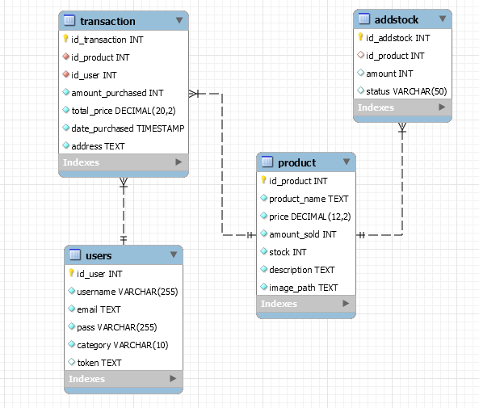
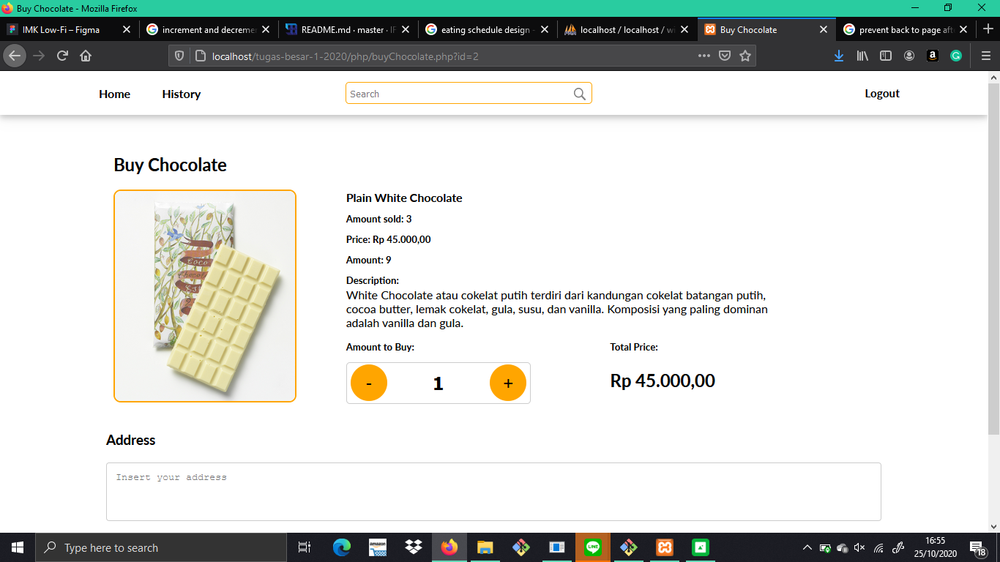
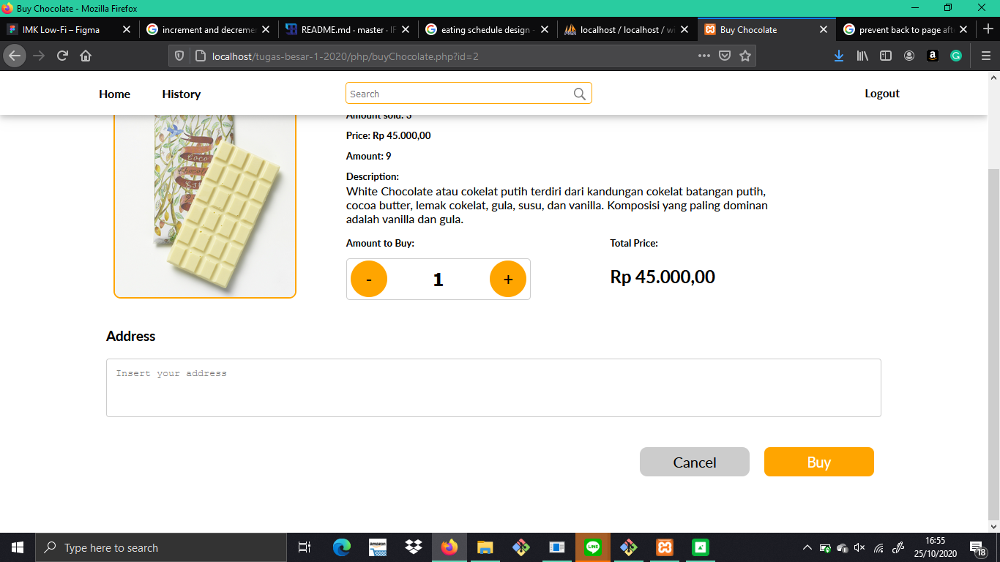
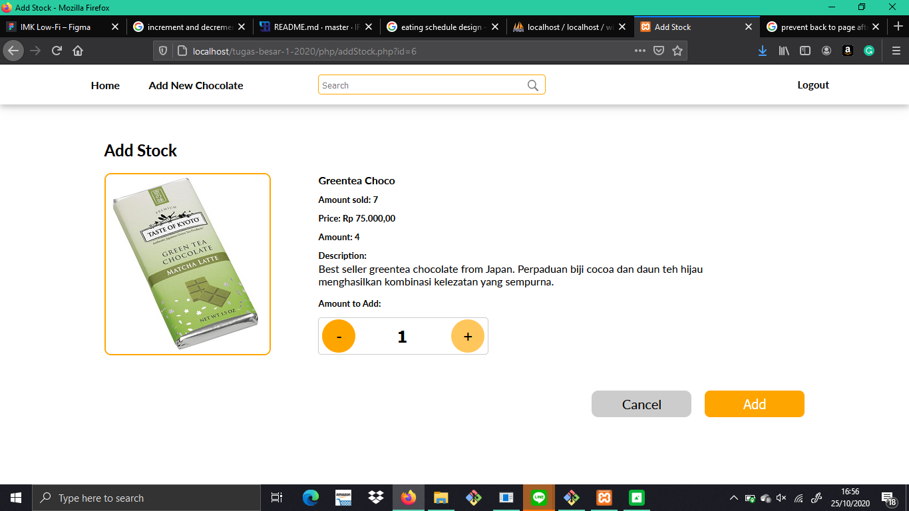
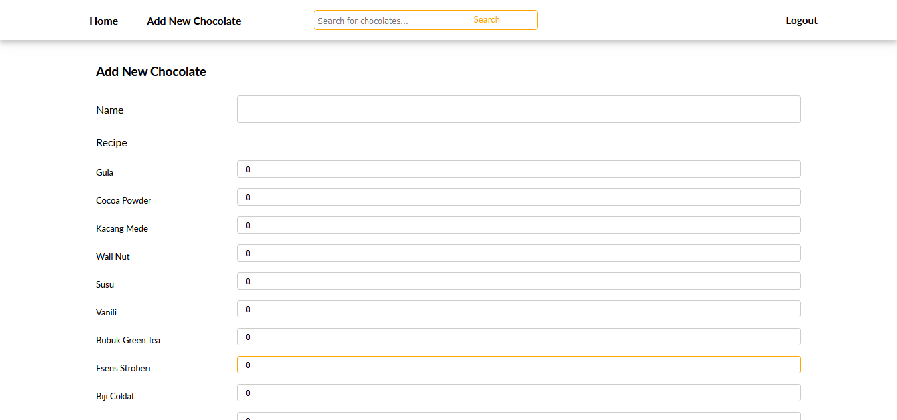
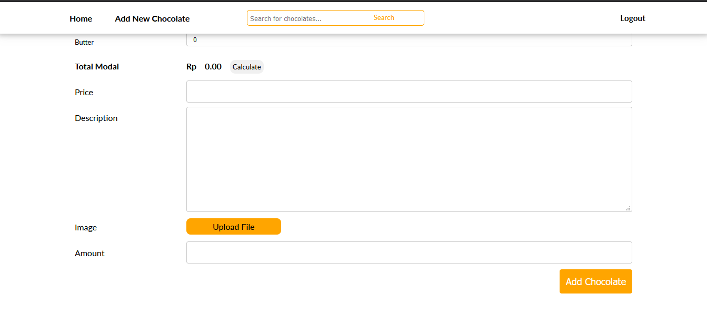

# Tugas 2 IF3110 Pengembangan Aplikasi Berbasis Web - Willy Wangky's Web

## Deskripsi Singkat

Willy Wangky's Web adalah aplikasi berbasis website yang dibuat menggunakan HTML, CSS, Javascript dasar, dan PHP. Web tersebut memungkinkan penggunanya dapat melakukan pendaftaran akun, login, logout, pencarian produk, mendapatkan penjelasan produk secara detail, pembelian produk dan dapat melihat riwayat pembelian produk, dan pekerjanya dapat dengan mudah menambahkan jenis coklat baru yang ingin dijual serta menambah ketersediaan coklat.

## Basis Data

### Tabel

| Nomor | Relasi | Penjelasan                                                                                     |
|-------|--------|------------------------------------------------------------------------------------------------|
| 1     | users  | Relasi ini berisi data pengguna website willy wangky, yaitu email, username, password, dan random string (token) untuk cookie          |
| 2     | transaction  | Relasi ini berisi data transaksi pengguna yang membeli cokelat         |
| 3     | product  | Relasi ini berisi data produk cokelat yang dijual di web          |
| 4     | addstock  | Relasi ini berisi data request penambahan stock ke ws-factory          |

## Screenshot
### Buy Chocolate

### Add Stock Chocolate

### Add New Chocolate

## Pembagian Tugas

### REST
1. Menerima input untuk transaksi bahan baku dengan Factory Management Pro : 13518020
2. Memberikan respon jumlah uang hasil transaksi beserta status berhasil pada transakti bahan baku : 13518020
3. Memberikan respon jumlah uang yang kurang agar transaksi berhasil beserta status gagal : 13518020
4. Memberi daftar bahan yang dijual : 13518045

### SOAP
1. Login dan Logout : 13518045
2. Menambahkan jenis cokelat baru + resep : 13518045
3. Menambahkan permintaan add stock baru : 13518045
4. Mengembalikan status dari permintaan add stock : 13518045
5. Melakukan pembuatan coklat tertentu dengan jumlah tertentu, yaitu mengubah bahan tidak kedaluwarsa dalam stok gudang Factory menjadi coklat (yang masih berada dalam gudang Factory) dan mengurangi bahan dalam gudang apabila bahan cukup : 13518045
6. Mengubah status permintaan add stock, dalam artian melakukan pengiriman terhadap toko Willy Wangky : 13518045
7. Menambah saldo yang pada Factory : 13518020
8. Mengembalikan saldo yang dimiliki pada Factory : 13518020
9. Menambahkan bahan dalam gudang : 13518020

### ReactJs
1. Login : 13518045
2. Halaman Utama : 13518045
3. Memberikan approval terhadap pesanan coklat dari WWWeb : 13518045
4. Melihat daftar pemesanan coklat dari WWWeb : 13518045
5. Melihat daftar bahan yang tersedia di pabrik : 13518045
6. Melihat daftar harga bahan yang tersedia di supplier : 13518020
7. Membeli bahan dari supplier : 13518020
8. Melihat daftar resep coklat : 13518045
9. Melihat daftar coklat yang tersedia di pabrik : 13518045
10. Melihat saldo pabrik : 13518020
11. Memproduksi cokelat dari bahan mentah : 13518045

### Perubahan Willy Wangkys Web
1. Perubahan Tampilan Halaman Add New Chocolate : 13518045
2. Request penambahan jenis cokelat baru dan resepnya ke WS-factory pada halaman add new chocolate: 13518045
3. Request add stock ke WS-factory pada halaman add Stock: 13518045
3. Request penambahan saldo ke WS-factory pada halaman Buy Chocolate : 13518045
